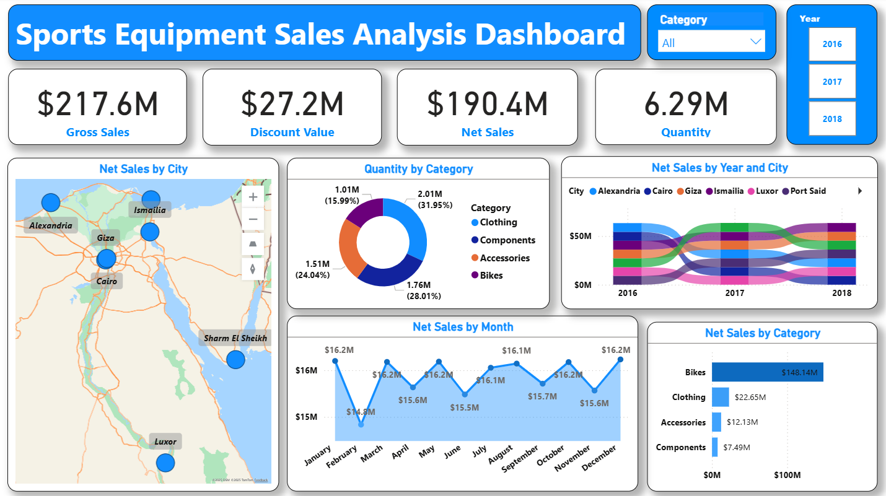

# Sports Equipment Sales Analysis Dashboard

📊 An interactive Power BI dashboard to analyze sales performance of sports equipment across different cities and years (2016–2018).  

This project provides clear insights into sales trends, product performance, and location-based comparisons to support better business decision-making.

---

## 🔍 Project Overview
The dashboard focuses on:
- Sales trends over three years (2016, 2017, 2018).
- Comparison of sales across different cities/locations.
- Analysis of product categories and their contribution to total sales.

---

## 🖼️ Dashboard Preview

---

## 📂 Dataset
The dataset contains **three tables** stored in an Access database:
- **SalesT** → Transaction details of sales.  
- **Products** → Information about different sports equipment items.  
- **Location** → Data about sales locations (cities).  

> ⚠️ Note: The dataset is used for **educational purposes only** and does not belong to any specific brand.

---

## 🛠️ Tools & Technologies
- **Power BI** → Data cleaning, transformation, and dashboard creation.  
- **MS Access** → Storing and organizing the dataset.  

---

## 📈 Key Insights
- **Top category:** Bikes achieved the highest net sales, reaching **148.14M**.  
- **Top-performing city:** Ismailia recorded the highest sales quantity with **899.37K units**.  
- **Lowest-performing city:** Luxor recorded the lowest sales and is a candidate for targeted promotions.  
- **Regional trends:** Alexandria and Cairo show declining sales over the period, while Port Said shows consistent growth.   

---

## 📌 Recommendations
Based on the insights from the Sports Equipment Sales Analysis Dashboard:

1. **Expand Branches in Ismailia**  
   Since Ismailia has shown the highest sales, consider opening more branches to maximize revenue.  

2. **Promotions in Luxor**  
   Sales in Luxor are the lowest, so introducing targeted discounts and promotions could help boost demand.  

3. **Increase Bikes Inventory**  
   Bikes are the top-selling category; maintaining a well-stocked inventory will help meet growing customer demand.  

4. **Regional Sales Trends**  
   Sales in Alexandria and Cairo have been declining over the years, while Port Said is showing consistent growth. Strategic marketing campaigns can help recover sales in Alexandria and Cairo, while further investment in Port Said may strengthen this upward trend.  

---

## 🚀 How to Use
1. Download the `.pbix` file from this repository.  
2. Open it in **Power BI Desktop**.  
3. Interact with filters and visuals to explore the insights.  

---

## 📜 License
This project is licensed under the **MIT License** – see the [LICENSE](./LICENSE) file for details.
